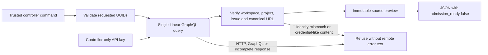
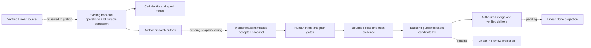

# Linear source preview

`swfactory linear-preview` reads one Linear issue on a trusted controller and prints a JSON
preview. It requires an immutable issue UUID, the expected workspace UUID, and the expected
project UUID. It preserves the title and description exactly and rejects mismatched identities.

This is a bounded source adapter, not native managed admission. The [intake design in PR2361](https://github.com/zozo123/ariflow-swfactory/pull/2361)
requires review before changing the protected backend and worker contracts.

## Run on a trusted controller

Provide `SWF_LINEAR_API_KEY` in the controller's environment through its existing secret
configuration. Do not put the key in the command, issue text, a work cell, or a worker bundle.
The command supports a Linear personal API key and uses the documented
[GraphQL authentication and error behavior](https://linear.app/developers/graphql).

```bash
uv run swfactory linear-preview <issue-uuid> \
  --workspace-id <workspace-uuid> \
  --project-id <project-uuid>
```

The workspace ID is Linear's organization UUID. The team UUID and URL slug cannot substitute
for it. The trusted controller must verify its own workspace and project scope. The command
refuses missing credentials before network I/O.

## Implemented flow



The source key is `linear:<workspace UUID>:<issue UUID>`. Display identifiers and issue URLs do
not determine identity. The intent digest covers that key, project UUID, team UUID, original
title, and original description. Status, identifier, URL, and `updatedAt` changes do not change
the digest. A changed title or description does. An appended PR link in the description is a
description edit and therefore changes the digest; future status projection must use Linear
attachments instead of editing accepted text.

This digest identifies the preview's text only. It is not the final work-order key or an
accepted-input receipt. Dependencies, allowed paths, target, blueprint and policy must be bound
at managed admission. A completed or archived issue can be inspected, but every preview still
says `admission_ready: false`. Linear Done never proves merged delivery.

The client issues a single bounded read, refuses redirects, and does not retry automatically.
GraphQL partial errors, oversized or malformed responses, unknown workflow states and missing
required fields all refuse the read. Error messages do not echo server text. Known credential
patterns and a response containing the controller key are rejected; this check cannot detect
every possible secret in free text, so a preview must not be passed directly to a work cell.

## Still required for managed admission



The dotted steps remain unimplemented. The existing backend still accepts GitHub-style issue
references, and workers still fetch issues through SCM. Do not pass a Linear UUID to that route,
create a GitHub issue as a bridge, or use a preview as an admission receipt.

The maintenance migration must add a versioned work-source reference and accepted snapshot to
the existing work order, qualify old-worker rejection, and preserve duplicate/lost-response/
restart recovery through the existing operation journal and admission outbox. It must also
resolve dependency receipts, replace GitHub issue creation in maintenance paths, and journal
Linear status and PR-link projections. Airflow remains the only lifecycle scheduler. No new
poller, task queue, dispatch loop, approval authority or automatic merge is added here.

Deployment qualification still requires actual backend credentials, provider and sandbox checks,
doctor, managed-worker wiring, target contract qualification and effective promotion protection.
A managed pilot cannot run until those checks and reviewed native intake are complete.

## Verification

`uv run pytest tests/test_linear_source.py` exercises the real parser and CLI with an injected
HTTP transport. It covers immutable text, stable UUID identity across JSON reloads, intent
edits, status-only changes, malformed/unauthorized source data, GraphQL partial success,
credential rejection, bounded responses, API errors and absence of admission in CLI output.
The transport assertions require one GraphQL query and no mutation operation.

These tests do not prove a live Linear credential, restart-safe admission, a managed Cell,
Airflow execution, publication, status projection or a qualified deployment. Those require the
eight behavior gates in the intake design and exact-candidate factory CI.
